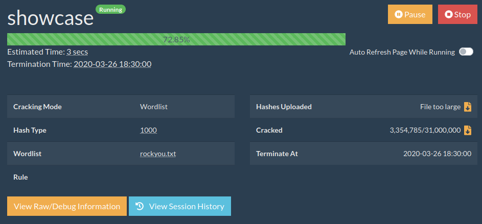
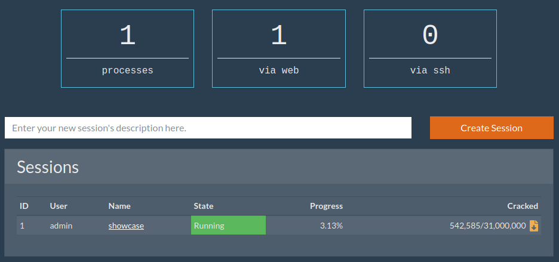
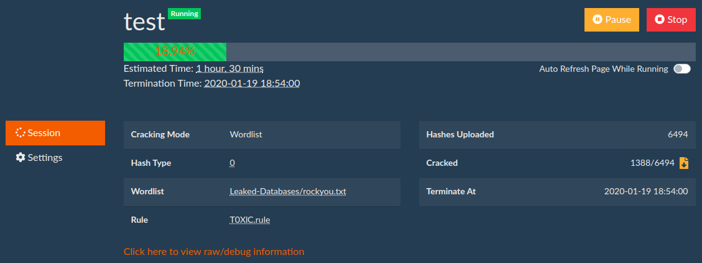
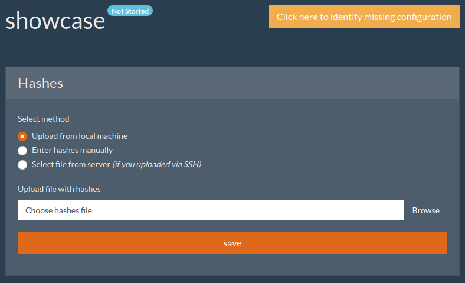
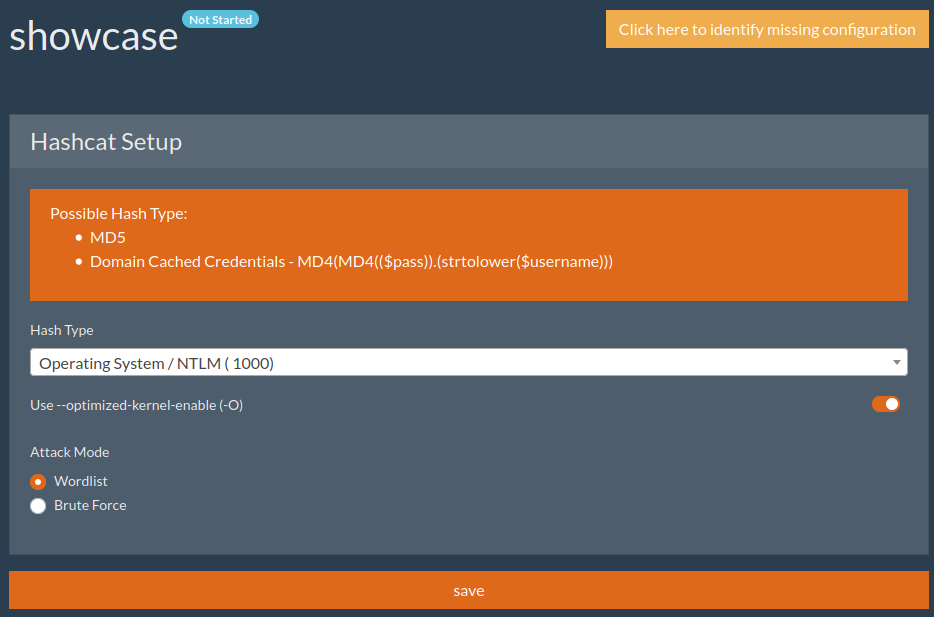
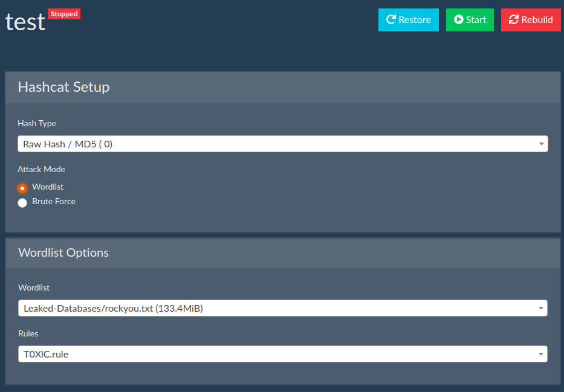
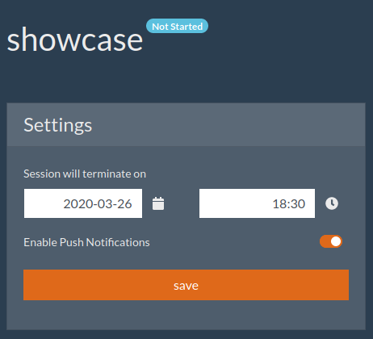

# CrackerJack

Web Interface for Hashcat by [Context Information Security](https://www.contextis.com/en/)

## Demo / Start Cracking in Under 5 Minutes

# Contents

* [Introduction](#introduction)
* [Architecture](#architecture)
* [Features](#features)
* [Limitations](#limitations)
* [Installation](docs/installation.md)
* [Troubleshooting](docs/troubleshooting.md)
* [Screenshots](#screenshots)
* [License](#license)

## Introduction

CrackerJack is a Web GUI for [Hashcat](https://hashcat.net/hashcat/) developed in Python.

## Architecture

This project aims to keep the GUI and Hashcat independent. In a nutshell, here's how it works:

* User uploads hashes, selects wordlist/rules/mask etc, and clicks "start".
* Web server spawns a new [screen](https://www.gnu.org/software/screen/).
  * Generates the hashcat command based on the settings.
  * Runs the command in the screen.
  * Monitors the screen's output, parses it, and displays in the GUI.

This allows CrackerJack to be future-proof as it ties to the input/output of Hashcat. Also, if the GUI is not working for whatever reason, hashcat will keep running.

## Features

* Minimal dependencies
  * Uses [sqlite3](https://www.sqlite.org/index.html), [screen](https://www.gnu.org/software/screen/), and hashcat.
* Complete hashcat session management.
  * Start/stop/pause/restore running sessions.
  * Terminate cracking jobs after a specific date/time.
* Web interface for mask generation (?a?l?u).
* Web Push notifications when a password is cracked.
* Swagger 2.0 API.
* Create wordlists from already cracked passwords and feed back into the cracking session.
* Session history to track which attacks you have already performed.
* Multi-user support (local and/or LDAP).
* Wordlist/Mask/Rule support.
* Multiple theme support ([Bootswatch](https://bootswatch.com/)).
* Straight-forward setup.
  * Entire configuration is via the GUI. No need for manually editing config files.
  * Run locally on Linux and Windows (WSL).
  * Install on a server using ansible scripts (Ubuntu 14/16/18 and CentOS 7/8).
  * Easy backups - all user data are in the `./data` directory.
* Troubleshoot sessions via SSH.

## Limitations

* Not a solution for queueing jobs - it's only for on-demand password cracking.
* Not meant to be a replacement for command-line usage. It's complimentary and only supports basic and most common cracking tasks.
* Will not install any GPU drivers. The main assumption is that you have a cracking rig already setup and are looking for a Web GUI.
* Wordlists and rules should already be present on the system.

## Contribution

As we maintain an internal tracker as well, before contributing please create an issue to discuss before implementing any features/changes.

# Screenshots

## Running Session

## Dashboard

## Session

## Selecting Hashes

## HashType Options

## Wordlist Selection

## Mask Generation

## General Session Settings

# License

CrackerJack is released under MIT License.

In addition, the following third-party components are also used:

* office2hashcat.py - modified BSD - https://github.com/stricture/hashstack-server-plugin-hashcat/