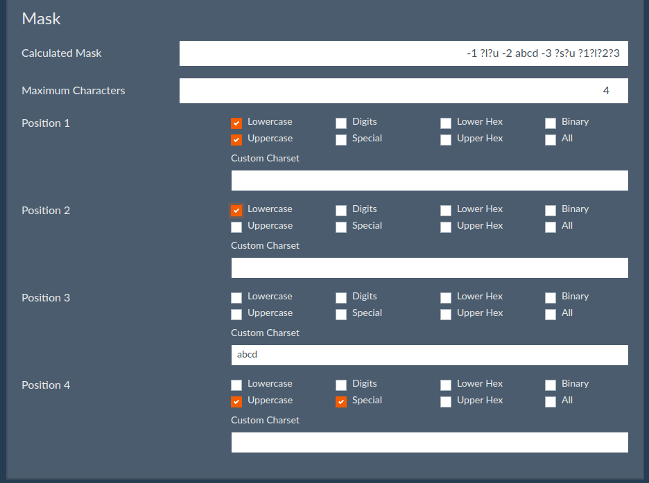

# CrackerJack

Web Interface for Hashcat by [Context Information Security](https://www.contextis.com/en/)

## Contents

- [Introduction](#introduction)
  - [Assumptions](#assumptions)
- [Features](#features)
- [Installation](#installation)
- [Screenshots](#screenshots)

## Introduction

CrackerJack is a Web GUI for [Hashcat](https://hashcat.net/hashcat/) developed in Python.

This web application is designed to run on a single machine, rather than a distributed cracking rig.

### Assumptions

The main assumption is that you already have Hashcat installed on a machine, as these instructions will not guide you through compiling Hashcat or setting up GPU drivers. 

## Features

* Complete Job/Session Management
  * Start/Pause/Restore/Stop Hashcat Sessions
* Bruteforce Mask Generator GUI
* Multi-User Support
  * LDAP and/or Local Authentication
* Multiple Theme Support (From [Bootswatch](https://bootswatch.com/))
* Time-Limit Hashcat Sessions

And most importantly, this application has been designed for **minimal dependencies**. This means that you don't need to install any database services, memory brokers, docker etc. It all runs on Apache/nginx, python, [screen](https://www.gnu.org/software/screen/), and [sqlite3](https://www.sqlite.org/index.html). 

## Installation

CrackerJack has only been tested on Ubuntu, for installation instructions please see [INSTALL.md](install.md)

## Screenshots

### Dashboard

### Session

### Wordlist Setup

### Mask Generator GUI

