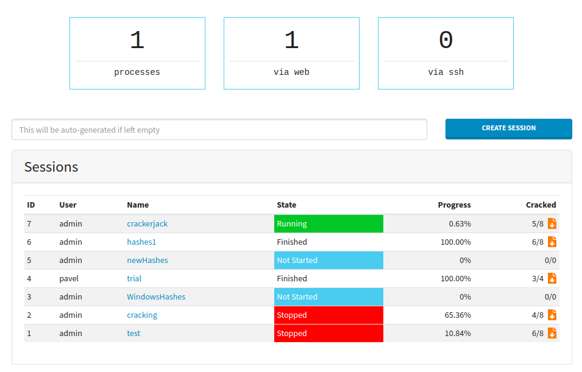
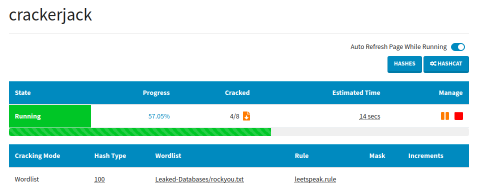
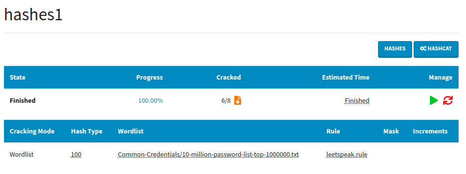
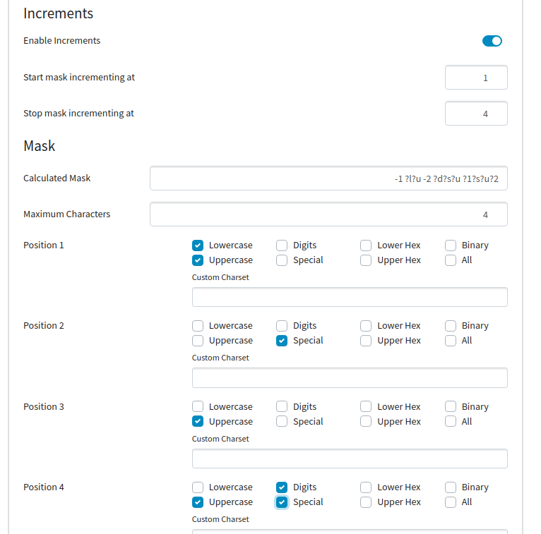
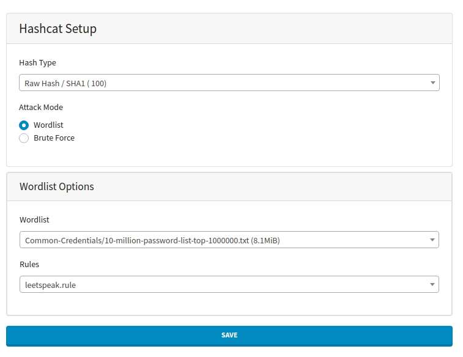

# CrackerJack

Web Interface for Hashcat by Context Information Security

## Assumptions

* The main assumption is that you already have a box that runs hashcat, as this solution will not guide you through setting up GPU drivers etc.
* You don't have to change anything in your setup. As long as you have a working hashcat installation, you are good to go.

## Features

* Multi-user
* LDAP Integration
* Hashcat Mask Generator GUI
* API (experimental)
* Multiple Themes

## Installation

Please read [install.md](install.md) for instructions on how to install CrackerJack on your system.

## Screenshots

### Home

### Session in Progress

### Session Finished

### Brute Force Mask Generator

### Wordlist Setup

